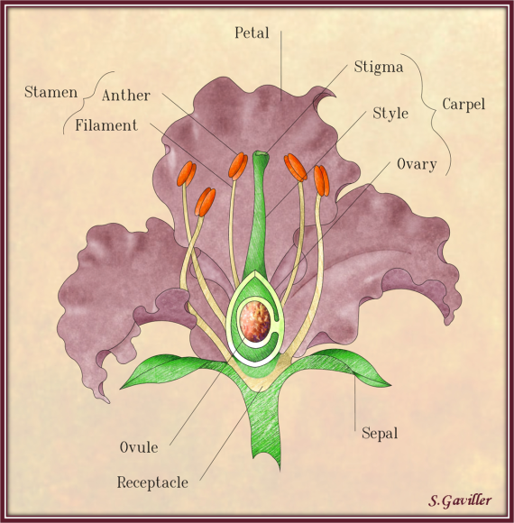
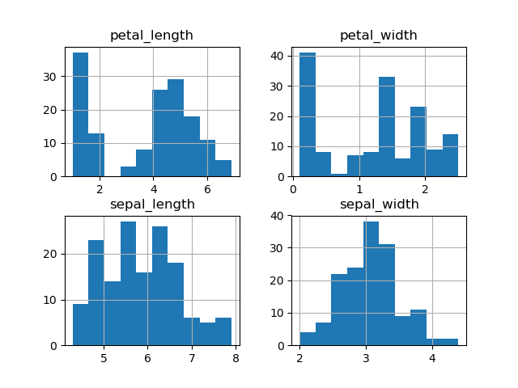
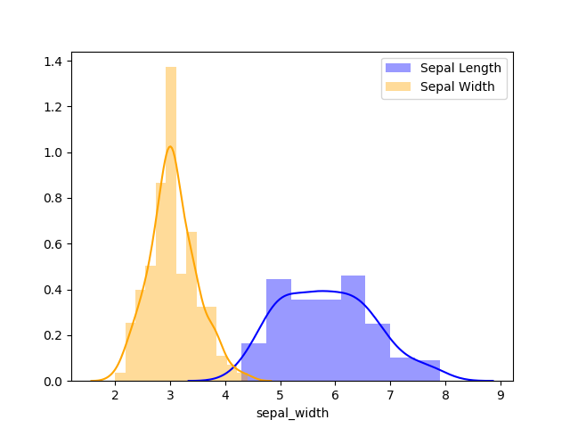
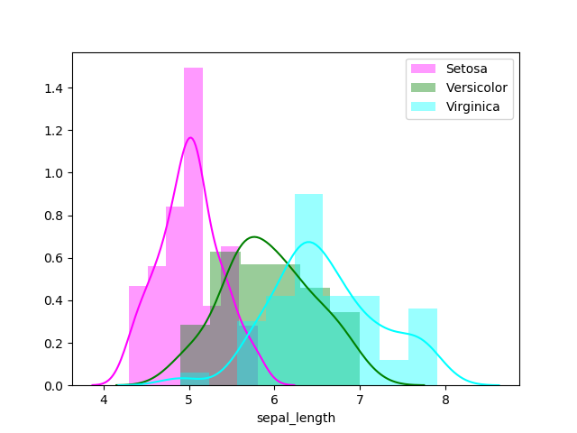
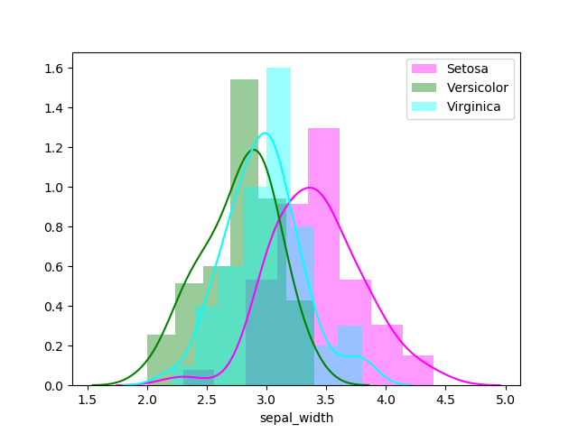
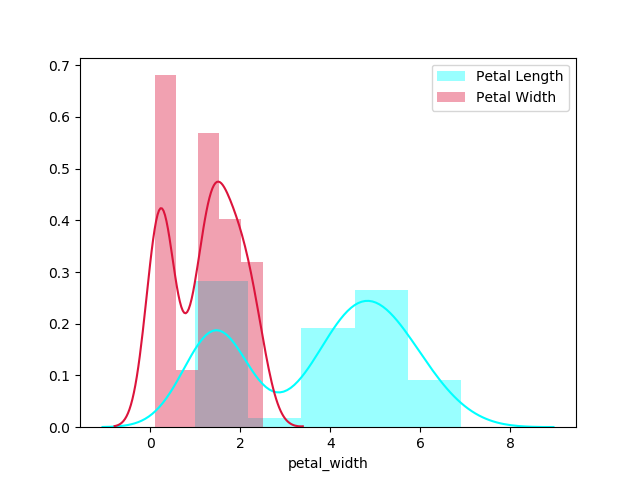

# Programming & Scripting Project 2019

This repository contains my files, data and python code for the Programming & Scripting Project for 2019 on Fisher's Iris Dataset.

## How to download this repository

1. Click this [link](https://github.com/Dowline1/PS-Project-2019.git) for my Github repository.
2. Click the download button.

## How to run the code

1. Make sure you have Python installed.
2. Instructions on how to install can be found in this [video.](https://web.microsoftstream.com/video/53a85003-eaaa-4724-afc2-b99ead7a0339)
3. You can then run Python files using a comman line interface such as CMDER install instructions located [here.](https://web.microsoftstream.com/video/52f3a795-f402-4862-8e14-94d3285bc807)
4. If additional help is required consult this video on [executing](https://web.microsoftstream.com/video/cd3347c4-8296-4e8c-bb63-01ef5452de17) a program.

## Background

**Ronald Fisher**

Ronald Fisher was a statistician and also a genetecist who lived during the period 17-Feb-1890 to 29-Jul-1962 born in Britain recognised by many as the person who pioneered the application of statisitical procedures to designing scientific experiments. Fisher attended the University of Cambridge  where he was awarded a scholarship in the study of Mathematics and went on to graduate in 1912 with his B.A..

Fisher remained in Cambridge University for an additional year to continue work in Astronomy and Physics and also studying the theory of errors. Upon leaving Cambrisge University Fisher then went on to teach High School Mathematics and Physics between 1914 and 1919 whilst also conducting research in statistics and Genetics.

In the year 1919 Fisher continued in his career and became the Statistician for the Rothamsted Station near to Harpenden in Hertfordshite specifically conducting statistical work relating to plant breeding experiments. Then in 1933 Fisher became Galton Professor of Eugenics at Universit College London which combined with previous experiments would lead him to publishing his paper on The use of Multiple Measurements in Taxonomic Problems that will relate directly to this Project.

**Multivariate Statistics**

**Taxonomic Problems Paper**

**Iris Species**

## Iris Diagram

fig.i. Iris Diagram

**Statistical Classification**

**Machine Learning**
Support Vector Machines

## How to Run the Code

## Histograms of Dataset

Fig.ii. shows a histogram of all elements of the Iris dataset combined and gives a nice presentation of the distribution of the measurements taken during the study.

fig.ii. Overall Histogram Trellis

Fig.iii. shows a comparison of the distribution of data points between sepal length and sepal width. This comparison goes into greater detail in figures iv and v and compares sepal lengths and widths across the 3 Iris species. 

fig.iii. Histogram Sepal Length & Width Comparison

fig.iv. Histogram Sepal Length Species Comparison

fig.v. Histogram Sepal Width Species Comparison

## Results of Python Calculations

**Overall Dataset Mean**

|    Column    |  Mean | 
|--------------|-------| 
| sepal_length | 5.843 | 
| sepal_width  | 3.054 | 
| petal_length | 3.759 | 
| petal_width  | 1.199 | 

**Overall Dataset Median**

|    Column    |Median| 
|--------------|------| 
| sepal_length | 5.8  | 
| sepal_width  | 3.0  | 
| petal_length | 4.35 | 
| petal_width  | 1.3  | 

**Mean by Species**

| species    | sepal_length | sepal_width | petal_length | petal_width | 
|------------|--------------|-------------|--------------|-------------| 
| setosa     | 5.006        | 3.418       | 1.464        | 0.244       | 
| versicolor | 5.936        | 2.77        | 4.26         | 1.326       | 
| virginica  | 6.588        | 2.974       | 5.552        | 2.026       | 

**Median by Species**

| species    | sepal_length | sepal_width | petal_length | petal_width | 
|------------|--------------|-------------|--------------|-------------| 
| setosa     | 5.0          | 3.4         | 1.5          | 0.2         | 
| versicolor | 5.9          | 2.8         | 4.35         | 1.3         | 
| virginica  | 6.5          | 3.0         | 5.55         | 2.0         | 

## Fisher Iris Dataset Table

| sepal_length | sepal_width | petal_length | petal_width | species |
| --- | --- | --- | --- | --- |
| 5.1 | 3.5 | 1.4 | 0.2 | setosa |
| 4.9 | 3.0 | 1.4 | 0.2 | setosa |
| 4.7 | 3.2 | 1.3 | 0.2 | setosa |
| 4.6 | 3.1 | 1.5 | 0.2 | setosa |
| 5.0 | 3.6 | 1.4 | 0.2 | setosa |
| 5.4 | 3.9 | 1.7 | 0.4 | setosa |
| 4.6 | 3.4 | 1.4 | 0.3 | setosa |
| 5.0 | 3.4 | 1.5 | 0.2 | setosa |
| 4.4 | 2.9 | 1.4 | 0.2 | setosa |
| 4.9 | 3.1 | 1.5 | 0.1 | setosa |
| 5.4 | 3.7 | 1.5 | 0.2 | setosa |
| 4.8 | 3.4 | 1.6 | 0.2 | setosa |
| 4.8 | 3.0 | 1.4 | 0.1 | setosa |
| 4.3 | 3.0 | 1.1 | 0.1 | setosa |
| 5.8 | 4.0 | 1.2 | 0.2 | setosa |
| 5.7 | 4.4 | 1.5 | 0.4 | setosa |
| 5.4 | 3.9 | 1.3 | 0.4 | setosa |
| 5.1 | 3.5 | 1.4 | 0.3 | setosa |
| 5.7 | 3.8 | 1.7 | 0.3 | setosa |
| 5.1 | 3.8 | 1.5 | 0.3 | setosa |
| 5.4 | 3.4 | 1.7 | 0.2 | setosa |
| 5.1 | 3.7 | 1.5 | 0.4 | setosa |
| 4.6 | 3.6 | 1.0 | 0.2 | setosa |
| 5.1 | 3.3 | 1.7 | 0.5 | setosa |
| 4.8 | 3.4 | 1.9 | 0.2 | setosa |
| 5.0 | 3.0 | 1.6 | 0.2 | setosa |
| 5.0 | 3.4 | 1.6 | 0.4 | setosa |
| 5.2 | 3.5 | 1.5 | 0.2 | setosa |
| 5.2 | 3.4 | 1.4 | 0.2 | setosa |
| 4.7 | 3.2 | 1.6 | 0.2 | setosa |
| 4.8 | 3.1 | 1.6 | 0.2 | setosa |
| 5.4 | 3.4 | 1.5 | 0.4 | setosa |
| 5.2 | 4.1 | 1.5 | 0.1 | setosa |
| 5.5 | 4.2 | 1.4 | 0.2 | setosa |
| 4.9 | 3.1 | 1.5 | 0.1 | setosa |
| 5.0 | 3.2 | 1.2 | 0.2 | setosa |
| 5.5 | 3.5 | 1.3 | 0.2 | setosa |
| 4.9 | 3.1 | 1.5 | 0.1 | setosa |
| 4.4 | 3.0 | 1.3 | 0.2 | setosa |
| 5.1 | 3.4 | 1.5 | 0.2 | setosa |
| 5.0 | 3.5 | 1.3 | 0.3 | setosa |
| 4.5 | 2.3 | 1.3 | 0.3 | setosa |
| 4.4 | 3.2 | 1.3 | 0.2 | setosa |
| 5.0 | 3.5 | 1.6 | 0.6 | setosa |
| 5.1 | 3.8 | 1.9 | 0.4 | setosa |
| 4.8 | 3.0 | 1.4 | 0.3 | setosa |
| 5.1 | 3.8 | 1.6 | 0.2 | setosa |
| 4.6 | 3.2 | 1.4 | 0.2 | setosa |
| 5.3 | 3.7 | 1.5 | 0.2 | setosa |
| 5.0 | 3.3 | 1.4 | 0.2 | setosa |
| 7.0 | 3.2 | 4.7 | 1.4 | versicolor |
| 6.4 | 3.2 | 4.5 | 1.5 | versicolor |
| 6.9 | 3.1 | 4.9 | 1.5 | versicolor |
| 5.5 | 2.3 | 4.0 | 1.3 | versicolor |
| 6.5 | 2.8 | 4.6 | 1.5 | versicolor |
| 5.7 | 2.8 | 4.5 | 1.3 | versicolor |
| 6.3 | 3.3 | 4.7 | 1.6 | versicolor |
| 4.9 | 2.4 | 3.3 | 1.0 | versicolor |
| 6.6 | 2.9 | 4.6 | 1.3 | versicolor |
| 5.2 | 2.7 | 3.9 | 1.4 | versicolor |
| 5.0 | 2.0 | 3.5 | 1.0 | versicolor |
| 5.9 | 3.0 | 4.2 | 1.5 | versicolor |
| 6.0 | 2.2 | 4.0 | 1.0 | versicolor |
| 6.1 | 2.9 | 4.7 | 1.4 | versicolor |
| 5.6 | 2.9 | 3.6 | 1.3 | versicolor |
| 6.7 | 3.1 | 4.4 | 1.4 | versicolor |
| 5.6 | 3.0 | 4.5 | 1.5 | versicolor |
| 5.8 | 2.7 | 4.1 | 1.0 | versicolor |
| 6.2 | 2.2 | 4.5 | 1.5 | versicolor |
| 5.6 | 2.5 | 3.9 | 1.1 | versicolor |
| 5.9 | 3.2 | 4.8 | 1.8 | versicolor |
| 6.1 | 2.8 | 4.0 | 1.3 | versicolor |
| 6.3 | 2.5 | 4.9 | 1.5 | versicolor |
| 6.1 | 2.8 | 4.7 | 1.2 | versicolor |
| 6.4 | 2.9 | 4.3 | 1.3 | versicolor |
| 6.6 | 3.0 | 4.4 | 1.4 | versicolor |
| 6.8 | 2.8 | 4.8 | 1.4 | versicolor |
| 6.7 | 3.0 | 5.0 | 1.7 | versicolor |
| 6.0 | 2.9 | 4.5 | 1.5 | versicolor |
| 5.7 | 2.6 | 3.5 | 1.0 | versicolor |
| 5.5 | 2.4 | 3.8 | 1.1 | versicolor |
| 5.5 | 2.4 | 3.7 | 1.0 | versicolor |
| 5.8 | 2.7 | 3.9 | 1.2 | versicolor |
| 6.0 | 2.7 | 5.1 | 1.6 | versicolor |
| 5.4 | 3.0 | 4.5 | 1.5 | versicolor |
| 6.0 | 3.4 | 4.5 | 1.6 | versicolor |
| 6.7 | 3.1 | 4.7 | 1.5 | versicolor |
| 6.3 | 2.3 | 4.4 | 1.3 | versicolor |
| 5.6 | 3.0 | 4.1 | 1.3 | versicolor |
| 5.5 | 2.5 | 4.0 | 1.3 | versicolor |
| 5.5 | 2.6 | 4.4 | 1.2 | versicolor |
| 6.1 | 3.0 | 4.6 | 1.4 | versicolor |
| 5.8 | 2.6 | 4.0 | 1.2 | versicolor |
| 5.0 | 2.3 | 3.3 | 1.0 | versicolor |
| 5.6 | 2.7 | 4.2 | 1.3 | versicolor |
| 5.7 | 3.0 | 4.2 | 1.2 | versicolor |
| 5.7 | 2.9 | 4.2 | 1.3 | versicolor |
| 6.2 | 2.9 | 4.3 | 1.3 | versicolor |
| 5.1 | 2.5 | 3.0 | 1.1 | versicolor |
| 5.7 | 2.8 | 4.1 | 1.3 | versicolor |
| 6.3 | 3.3 | 6.0 | 2.5 | virginica |
| 5.8 | 2.7 | 5.1 | 1.9 | virginica |
| 7.1 | 3.0 | 5.9 | 2.1 | virginica |
| 6.3 | 2.9 | 5.6 | 1.8 | virginica |
| 6.5 | 3.0 | 5.8 | 2.2 | virginica |
| 7.6 | 3.0 | 6.6 | 2.1 | virginica |
| 4.9 | 2.5 | 4.5 | 1.7 | virginica |
| 7.3 | 2.9 | 6.3 | 1.8 | virginica |
| 6.7 | 2.5 | 5.8 | 1.8 | virginica |
| 7.2 | 3.6 | 6.1 | 2.5 | virginica |
| 6.5 | 3.2 | 5.1 | 2.0 | virginica |
| 6.4 | 2.7 | 5.3 | 1.9 | virginica |
| 6.8 | 3.0 | 5.5 | 2.1 | virginica |
| 5.7 | 2.5 | 5.0 | 2.0 | virginica |
| 5.8 | 2.8 | 5.1 | 2.4 | virginica |
| 6.4 | 3.2 | 5.3 | 2.3 | virginica |
| 6.5 | 3.0 | 5.5 | 1.8 | virginica |
| 7.7 | 3.8 | 6.7 | 2.2 | virginica |
| 7.7 | 2.6 | 6.9 | 2.3 | virginica |
| 6.0 | 2.2 | 5.0 | 1.5 | virginica |
| 6.9 | 3.2 | 5.7 | 2.3 | virginica |
| 5.6 | 2.8 | 4.9 | 2.0 | virginica |
| 7.7 | 2.8 | 6.7 | 2.0 | virginica |
| 6.3 | 2.7 | 4.9 | 1.8 | virginica |
| 6.7 | 3.3 | 5.7 | 2.1 | virginica |
| 7.2 | 3.2 | 6.0 | 1.8 | virginica |
| 6.2 | 2.8 | 4.8 | 1.8 | virginica |
| 6.1 | 3.0 | 4.9 | 1.8 | virginica |
| 6.4 | 2.8 | 5.6 | 2.1 | virginica |
| 7.2 | 3.0 | 5.8 | 1.6 | virginica |
| 7.4 | 2.8 | 6.1 | 1.9 | virginica |
| 7.9 | 3.8 | 6.4 | 2.0 | virginica |
| 6.4 | 2.8 | 5.6 | 2.2 | virginica |
| 6.3 | 2.8 | 5.1 | 1.5 | virginica |
| 6.1 | 2.6 | 5.6 | 1.4 | virginica |
| 7.7 | 3.0 | 6.1 | 2.3 | virginica |
| 6.3 | 3.4 | 5.6 | 2.4 | virginica |
| 6.4 | 3.1 | 5.5 | 1.8 | virginica |
| 6.0 | 3.0 | 4.8 | 1.8 | virginica |
| 6.9 | 3.1 | 5.4 | 2.1 | virginica |
| 6.7 | 3.1 | 5.6 | 2.4 | virginica |
| 6.9 | 3.1 | 5.1 | 2.3 | virginica |
| 5.8 | 2.7 | 5.1 | 1.9 | virginica |
| 6.8 | 3.2 | 5.9 | 2.3 | virginica |
| 6.7 | 3.3 | 5.7 | 2.5 | virginica |
| 6.7 | 3.0 | 5.2 | 2.3 | virginica |
| 6.3 | 2.5 | 5.0 | 1.9 | virginica |
| 6.5 | 3.0 | 5.2 | 2.0 | virginica |
| 6.2 | 3.4 | 5.4 | 2.3 | virginica |
| 5.9 | 3.0 | 5.1 | 1.8 | virginica |

## References & File Sources
Note: Additional reference information and detailed commentary on how the Python code works can be found in the respective files.

- fisher_iris_dataset.txt downloaded from this [link](https://gist.github.com/curran/a08a1080b88344b0c8a7)
- The use of Multiple Measurements in Taxonomic Problems by R.A. Fisher [link](https://onlinelibrary.wiley.com/doi/abs/10.1111/j.1469-1809.1936.tb02137.x)
- Ronald Fisher [link](https://www.britannica.com/biography/Ronald-Aylmer-Fisher)
- Iris Diagram [link](https://www.pinterest.ie/pin/325174035570472597/)
- Reading CVS file with Pandas [link](https://datatofish.com/use-pandas-to-calculate-stats-from-an-imported-csv-file/)
- Converting Dataframe to CSV [link](https://chrisalbon.com/python/data_wrangling/pandas_saving_dataframe_as_csv/)
- Converting .csv to .md [link](https://donatstudios.com/CsvToMarkdownTable)
- Group by for mean [link](https://datatofish.com/use-pandas-to-calculate-stats-from-an-imported-csv-file/)
- Seaborn info for graphing [link](https://python-graph-gallery.com/25-histogram-with-several-variables-seaborn/)
- Seaborn guide for Histograms [link](http://python-graph-gallery.com/histogram/)
- Seaborn guide for Scatter Plots [link](http://python-graph-gallery.com/scatter-plot/)
- Color codes [link](https://matplotlib.org/examples/color/named_colors.html)
- Filtering Dataframes [link](https://pythonspot.com/pandas-filter/)